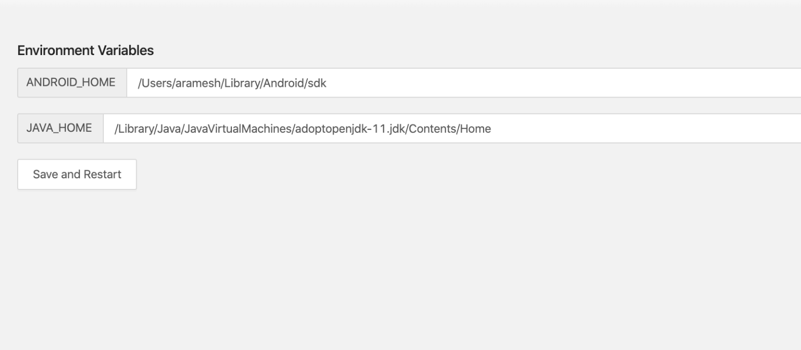
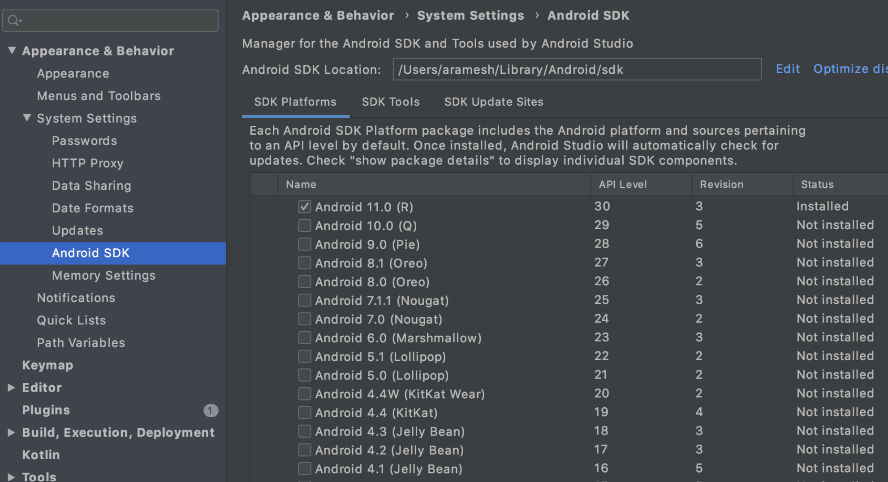
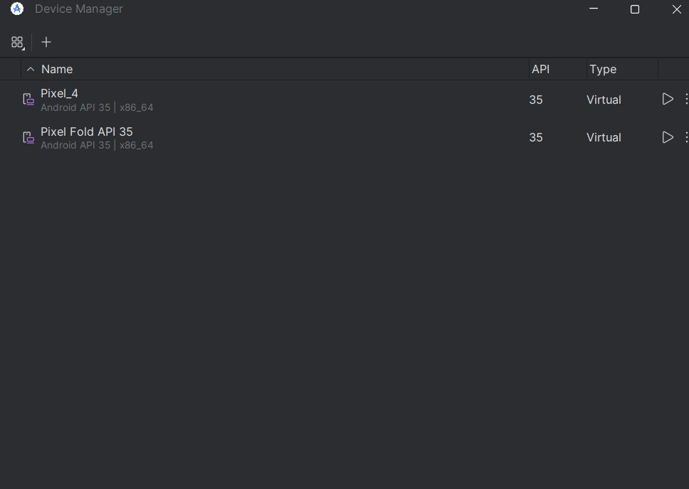
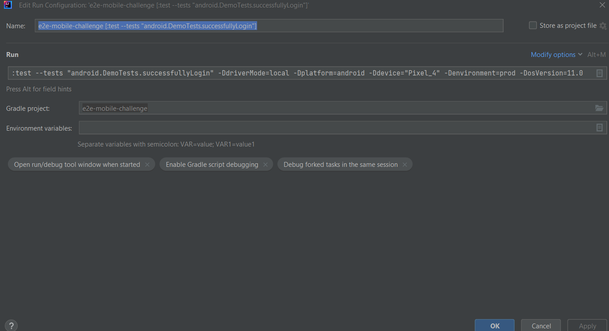

# Latch SDET Challenge

## Description

e2e-mobile-challenge is an e2e framework. It was developed using Java, gradle, and Appium.

<p align="center">
  
</p>

## 1. Install git

```bash
brew install git
```
## 2. Clone e2e-mobile-tests project from gitHub

```bash
git clone git@github.com:lafourchette/e2e-mobile-tests.git
```

## 3. Install Java 11 SDK

```bash
brew tap AdoptOpenJDK/openjdk
brew cask install adoptopenjdk11
```

Test that java 11 is correctly installed with

```bash
java -version
```

If it was correctly installed you should see something like

 ```bash
openjdk version "11.0.8" 2020-07-14
OpenJDK Runtime Environment AdoptOpenJDK (build 11.0.8+10)
OpenJDK 64-Bit Server VM AdoptOpenJDK (build 11.0.8+10, mixed mode)
```

## 4. Install Gradle

```bash
brew install gradle
```

## 5. Install IntelliJ IDEA CE

IntelliJ IDEA CE can be install from the jetbrains website: <https://www.jetbrains.com/idea/download/#section=mac>  
It can also be installed using brew:

```bash
brew cask install intellij-idea-ce
```

## 6. Download Appium desktop

Download appium desktop from http://appium.io/downloads.html

## 7. Download Android studio

Download Android studio from https://developer.android.com/studio.

## 8. Configure environment variables on Appium

Check if the environment variables are configured on Appium desktop
- Open Appium desktop from Applications
- Go to Edit Configurations on the start-up screen
- Check if the environment variables(JAVA_HOME and ANDROID_HOME) are set up.

If the configurations for has been set already, skip this step
* Copy the path of the variables (JAVA_HOME and ANDROID_HOME) from the terminal and add them to the appropriate variables on the edit configurations.
* Click on Save and restart to make the configurations effective.

<p align="center">
<kbd>
  
</kbd>
</p>

## 9. Configure Android studio:

1. Open android studio from applications. On the start-up screen, click on configure on the bottom of the screen and go to SDK manager.
1. Install the SDK version as required for the project.

<p align="center">
<kbd>
  
</kbd>
</p>

##  10. Running tests
* Place the file "James_Rider_1.22.0.apk" on the root folder of the project

* Make sure that a virtual device is added in Android studio -> Configure -> avd manager.

* Start the simulator from avd manager.

<p align="center">
<kbd>
  
</kbd>
</p>

* From the root folder of the e2e-mobile-tests project and execute the following command to run the tests.

  ```bash
   cd e2e-web-tests
  ./gradlew test -Dplatform=android -DdriverMode=local -Ddevice="Name of the android virtual device from android studio" -DosVersion=11.0 
  ```

This will execute all the tests of the e2e-mobile-tests project on android.

### 4.1 Intellij

Create a run configuration with the following arguments,

```
-Dplatform=android -DdriverMode=local -Ddevice="Name of the android virtual device from android studio" -DosVersion=11.0 
```

<p align="center">
<kbd>
  
</kbd>
</p>